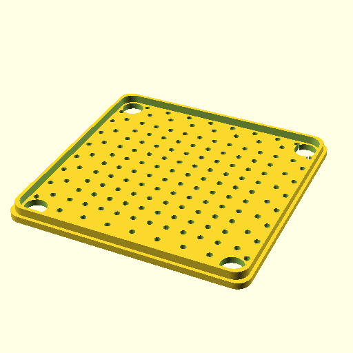
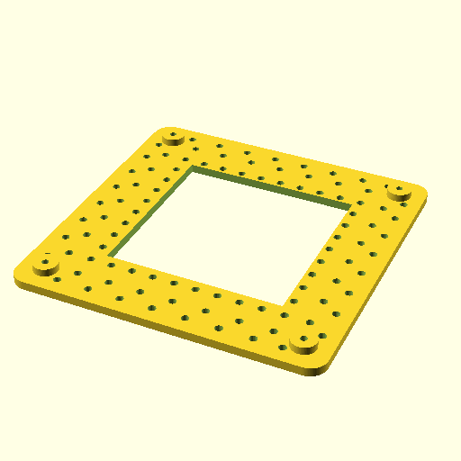

# PCB STENCIL JIG GIT

This project offers a 3d printable jig that that can be used as a help when you want to assemble your own pcb board. More specifically the jig provided in this project can help for keeping the PCB and Stencil on correct position when you spread the soldering paste to PCB by using the stencil as a help.


Jig consist of from 4 different parts that can be generated and exported easily with the openscad by modifying the parameters close to main function. Alrernatively, the project will try to generate model parts automatically from the Kicad project if you give the kicad_pcb file as a parameters so that it can check the PCB size in a following way for example:

```
./generate_jig_from_kicad_pcb_file.py ~/nokia/bell_labs/led_test/led_test.kicad_pcb
```

Execution of this script would then check the size of the PCB and based on that invoke the openscad project to generate 4 stl files on optimal size required for the pcb stencil JIG. 
Project aims however generate files in a way that for PCB sizes that are close to each other, 3 from the 4 stl models will remain same and only the inner PCB holder PCB model size will vary. This adds reusability for the projects and reduces the time required for printing 3d model parts.

Following 3d model stl files (and pictures of them) can be generated by using this project:
    
* container_box that provides the base for which all other parts will      be layered. All four corners will in addition require 35m length    springs for lifting the pcb_stencil_liftboard up once air suction/vacuum cleaner is turned off. Link for the spring I have used is provided below:
* lidboard with air holes that is put on top of the container box
* pcb_stencil_liftboard provides a frame that can lower and raise the pcb stencil. It is put on top of the lidboard. Air suction holes on pcb_holder_board are aligned with the lidboard so that the suction air will hold the stencil on place. It is designed to help for keeping the pcb and stencil on place when spreading the solder paste.
* pcb_holder_board is centered on the middle of the pcb_stencil_liftboard. In addition of air suctioning holes, it will also contain the mounting hole for the PCB. Depth of the mounting hole can be adjusted.

In addition of the 3D printable parts, you will also need following:
* Springs for lifting the PC 0.8x9mm OD,35mm Free Length springs ordered from Amazon: https://www.amazon.com/gp/product/B0B6J19Q14/ref=ppx_yo_dt_b_search_asin_title?ie=UTF8&th=1
* Vacuum cleaner or other air suctioning device. I have used my red-devil vacuum cleaner which pipe can be put to the hole in container_box to suct the air and hold pcb and stencil on place while spreading the solder paste.






## Example Model Files

3D models/stl folder contains example model files for the 142x142 container box construction that is optimal for PCB's which size is around 60 mm and stencil thus being usually over 80x80 mm of size.
* 3d_models/prusa/creality_3_s1_pro folder contains the 3d model prusaslicer 3D project and gcode files generated from those STL files as an example.

## License

PCB STENCIL JIG project is licensed under the GNU Lesser General Public License (LGPL) version 2.1 or later (LGPL v2.1+).

## Contact Information

Mika Laitio / Nokia Bell Labs. You can best reach me from my private email address: lamikr@gmail.com

It's always nice to get some feedback and improvement suggestions if you end up trying out this project.

## Credits

Credits for the idea goes for the following projects which gave idea for this project: https://github.com/scheffield/stencil-fix.git
https://github.com/MariusHeier/magik_solder_paste_stencil_box.git

Main advantage over those is the usage of openscad. This allows easy scriptable flexibility to generate the different size JIGS for different size PCB's very easily. As a proof of concept from this is the python script which allows user to specify the kicad project PCB file as a parameter for getting the PCB specific parameters to printout optimal size JIG. So in future, this project can be used for generate a plugin for Kicad and other PCB schematic tools. (Altium designer for example). Another advantage is that openscad as an opensource tool is freely available on multiple different operating system platforms.


